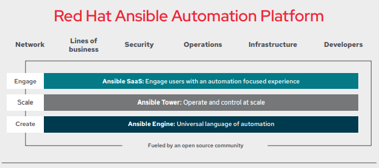

# ANSIBLE for WINNERS

give some information about ansible
- what is ansible?

-- A solution to solve automation of systems at scale. Ansible is a simple and powerful Automation engine. With the power to leverage groupings, you can run repeatable, autidable, and easy to source tasks at scale. The "at scale" part is important. Asnible is a command line tool and you need something like Jenkins or some other web wrapper to make your jobs click-n-go. Or you can spend 5 figures or more a year on Tower. 
- Deisgn Principles
-- Have a dead-simple setup process with a minimal learning curve.
-- Manage machines very quickly and in parallel.
-- Avoid custom-agents and additional open ports, be agentless by leveraging the existing SSH daemon.
-- Describe infrastructure in a language that is both machine and human friendly.
-- Focus on security and easy auditability/review/rewriting of content.
-- Manage new remote machines instantly, without bootstrapping any software.
-- Allow module development in any dynamic language, not just Python.
-- Be usable as non-root.
-- Be the easiest IT automation system to use, ever.
- Upcoming events
-- 20210518 ETA release Ansible 4.0.0
-- 20210608 Ansible Contributor Summit
- Latest version
-- Ansible 3.3.0 [more info](https://www.ansible.com/blog/announcing-the-community-ansible-3.0.0-package "Ansible 3 and how we got here"
- background information
-- python
-- RedHat owned
-- playbooks written in yaml
- security implications
-- what happens if someone compromises the system you run ansible from?
- security management
- ansible tower
- CMDB
-- Ansible Tower is a part of RedHats automation suite. 
- installation information
- background on modules
--- ansible-galaxy
--- provides collections of plugins
-- amazon aws [Collection info](https://galaxy.ansible.com/amazon/aws)
--- more on this later
-- the general collection
--- [Link](https://galaxy.ansible.com/community/general "the general community collection") [listing](https://docs.ansible.com/ansible/latest/collections/community/general/)
--- the general pack of community plugins
---- lastpass [plugin info](https://docs.ansible.com/ansible/latest/collections/community/general/lastpass_lookup.html#ansible-collections-community-general-lastpass-lookup) Use this plugin to have secrets in lastpass. boo logmein
---- Django manage [plugin info](https://docs.ansible.com/ansible/latest/collections/community/general/django_manage_module.html#ansible-collections-community-general-django-manage-module) Manage a Django application with this plugin
---- filesystem [plugin info](https://docs.ansible.com/ansible/latest/collections/community/general/filesystem_module.html#ansible-collections-community-general-filesystem-module) Use this plugin to make a filesystem of any type that is compatible with the host.
---- sefcontexte [plugin info](https://docs.ansible.com/ansible/latest/collections/community/general/sefcontext_module.html#ansible-collections-community-general-sefcontext-module) use this to manages selinux file context mapping definitions. it is like invoking `semanage fcontext`
- my 5 favorite modules
- get involved with development
-- [click here](https://docs.ansible.com/ansible/latest/community "Ansible community documentation") to find out about the Ansible community
-- [click here](https://github.com/ansible/community/wiki "Ansible Community Collaboration Wiki") to find out about what the community is currently working on.
-- [click here](https://github.com/ansible/community/wiki/News "The ansible Weekly Newsletter") for an aggregation of all the Ansible news in the form of a weekly newsletter.
- aws, the cloud, and beyond
-- There is a collection of modules provided by amazon that function just like the AWS CLI.
--- [amazon.aws](https://galaxy.ansible.com/amazon/aws "Amazon AWS Ansible Collection
--- ec2 inventory
--- rds inventory
--- aws account mgmt
--- feature overload (as is anything that interacts with the aws api)
- an introduction to yaml
- segway into infrastructure as code
- bring up terraform
-- terraform background
-- terraform use cases
-- whiteboard session on how terraform works
-- introduction to hcl
-- terraform modules
- bring it all back together
- discuss devops
-- devops and IAC
-- devops and SRE
-- git in the middle of it all
-- maybe a little tfs because an M$ community isn't all that bad